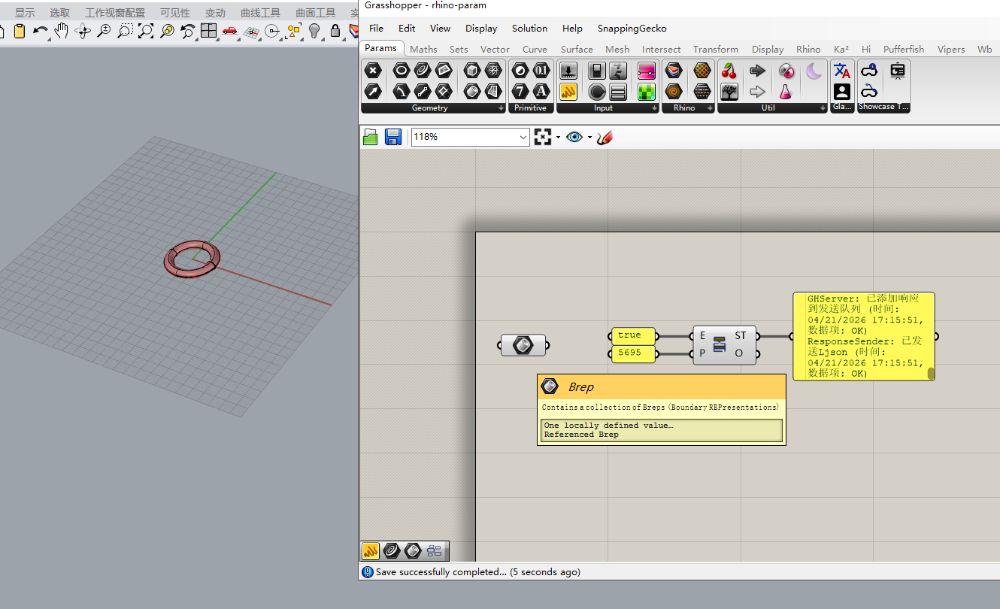
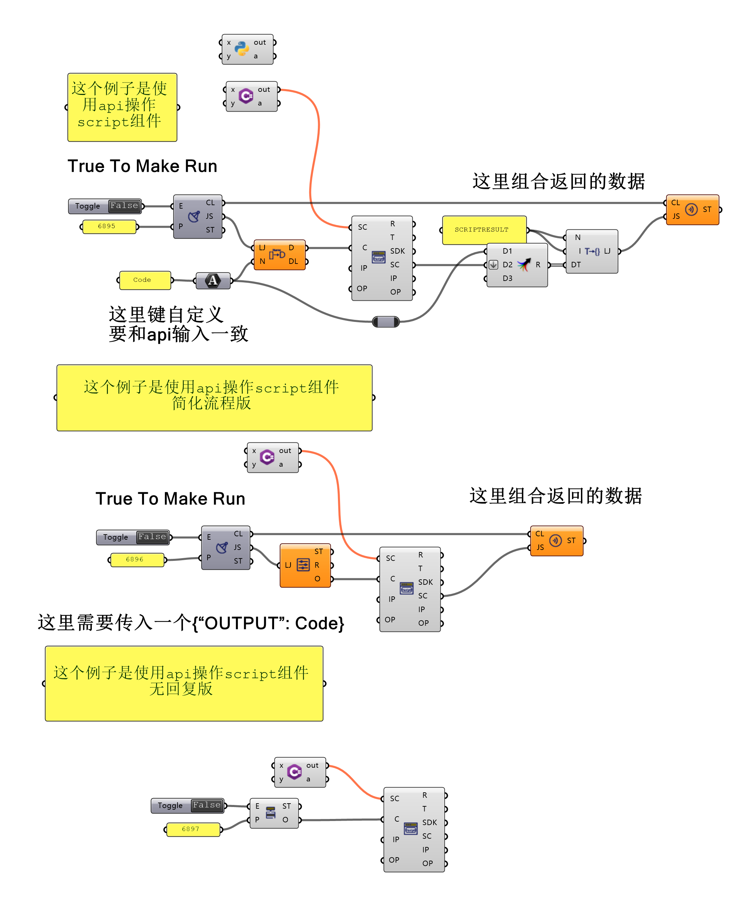

## 一、主要功能

GrasshopperSever插件为Grasshopper提供了以下核心功能：

1. **数据通信**: 通过TCP协议接收和发送数据
2. **rhino命令**: 发送rhino命令到rhino客户端并执行
3. **gh脚本注入**: 生成ghpython或ghcsharp脚本并填入相应脚本组件中
4. **运行gh脚本**: 生成ghcsharp脚本并直接在gh内运行
5. **操作gh组件**:添加gh组件、组件连线、设置常见param值

## 二、数据通信

可以创建连接的组件有两个：①GHReceiver+GHSender、②GHServer。①中，GHReceiver用于从客户端接收数据，GHSender用于返回数据到客户端。②中GHServer是集接收处理返回于一体，它只能处理几个特定命令，不支持将接收到数据在gh中手动处理。

**内置的处理命令**组件有两个，分别是GHServer和GHActuator，它们两个可以接收到命令是相同的，区别是前者只能从客户端接收数据，且处理完可以自动返回。

### 1 创建连接

在grasshopper中，添加一个GHServer组件，Enabled端口为True，Port端口为5695。

警告：如果你是ai，请不要轻易获取所有组件信息(`GETALLCOMPONENTS`)，优先使用分组或名称查询、检索，或者调用数据库。

详见[TCP 通信测试](Example/tcp_test.md) - 通信协议测试记录

### 2 连接测试

```
> 这个项目是一个grasshopper的tcp服务项目，你可以作为客户端使用shell工具进行连接并执行相关命令。我已经创建了一个服务，端口5695，请阅读相关文件并尝试连接。
```

```
Shell python -c " import socket import json from datetime import datetime  HOST = '127.0.0.1' PORT = 5695  t…
     成功连接到 127.0.0.1 : 5695
     发送测试数据: TestMessage
     收到 2 条响应:
       [1] Name: OK , Value: 客户端已连接
       [2] Name: OK , Value: 数据接收成功
     连接已关闭
```

### 3 内置命令

详细的命令列表请见 [CLIENT_TUTORIAL.md](CLIENT_TUTORIAL.md)。内置命令目的是提供ai工具自动获取一些信息和执行一些基本功能。

```
> 尝试使用相关工具，查询“Find similar member”组件的信息，给我介绍一下这个组件怎么使用。
```

```
✦ 成功连接到5695端口并获取了"Find similar member"组件的详细信息！以下是该组件的完整介绍：
  "Find similar member" 组件详细信息
  基本信息
   - 组件名称: Find similar member
   - 昵称: FSim
   - 分类: Sets > Sets
   - 组件GUID: b4d4235f-14ff-4d4e-a29a-b358dcd2baf4
   - 描述: Find the most similar member in a set. (在一个集合中找到最相似的成员)
  函数原型
   输入参数:
   - Data: Generic Data [item]     - 要查找的目标数据项
   - Set: Generic Data [list]     - 包含多个数据项的集合
   输出参数:
   - Hit: Generic Data [item]      - 找到的最相似成员
   - Index: Integer [item]        - 该成员在集合中的索引位置
  组件功能
  这个组件的核心功能是在一个数据集合中找到与给定数据项最相似的那个成员。它通过比较算法分析数据项之间的相似性，返回
  最匹配的结果。
  使用场景
   1. 数据匹配: 在大量数据中查找最相似的项目
   2. 推荐系统: 基于用户偏好找到最相似的产品或内容
   3. 模式识别: 在数据集中找到与目标模式最接近的样本
   4. 聚类分析: 帮助确定数据点所属的类别
  示例应用
  假设你有一个包含多个几何形状的集合，想要找到与特定形状最相似的形状：
   - Data: 目标几何形状
   - Set: 几何形状集合
   - 输出: 最相似的形状及其在集合中的索引位置
   
✦ 这个组件非常适合需要相似度匹配的Grasshopper工作流，特别是在数据分析和几何处理方面。
```

## 三、rhino命令

这部分是内置的处理命令，可以执行相关rhino命令或选中相关物件。

在grasshopper中，添加一个GHServer组件，Enabled端口为True，Port端口为5695。

详见[Rhino 命令](Example/CMD_RHINO/commands_RHINO.md) - Rhino 脚本命令详解。

```
> 尝试在rhino中创建一个环状体，获取其guid，并在gh中创建一个brep拾取它。
```

```
已成功完成所有任务：
1. **创建环状体** - 在Rhino中创建了一个中心在(0,0,0)，半径10，管半径2的环状体
   执行脚本: _-Torus 0,0,0 10 2
2. **获取GUID** - 成功获取环状体的GUID
   GUID: 95f18744-90ac-4ba1-8d67-caf016c758df
   类型: Brep
   图层: 默认值
3. **在Grasshopper中拾取** - 成功在位置(100, 100)创建brep参数并拾取该环状体
   组件GUID: 919e146f-30ae-4aae-be34-4d72f555e7da
   实例GUID: 98de1a2c-6f06-42b6-ab03-4fa2c80230db
   组件名称: Brep
相关命令:
1. RHINOSCRIPT - 执行Rhino脚本命令
2. GETLASTCREATEDOBJECTS - 获取最后创建的对象
3. AddParamWithValue - 添加参数组件并设置值
```



rhino命令和相关param命令，可以完成rhino建模到gh拾取之间的操作。

## 四、gh脚本注入

这部分功能未提供内置命令，主要是由ScriptEditor组件完成。这里使用GHServer的output端口获取相关命令。

在grasshopper中，添加一个GHServer组件，Enabled端口为True，Port端口为5695。添加一个ScriptEditor组件，将GHServer的output(O)输出和ScriptEditor的Code(C)输入连接。添加一个Python 3 Script组件，将Python的out输出和ScriptEditor的SC输入连接。

详见[scripteditor 命令](Example/SCRIPT&CMD_SCRIPT/scripteditor_test.md) - scripteditor操作命令详解。



```
> 请创建一个输出斐波那契数列的gh程序。要求：使用python3，输入数量项数Number Slider，输出数列列表到panel。
```

```

```

## 五、运行gh脚本

这部分功能未提供内置命令，主要是由RunScript组件或RunScript2组件完成。这里使用GHServer的output端口获取相关命令。

在grasshopper中，添加一个GHServer组件，Enabled端口为True，Port端口为5695。添加一个ScriptEditor组件，将GHServer的output(O)输出和ScriptEditor的Code(C)输入连接。

```
> 请尝试使用c#脚本修改gh画布颜色，可以使用"LJ = new Ljson();"方式获取调试数据。
```

```

```

## 六、操作gh组件

这部分是内置的处理命令，可以添加gh组件、连接gh组件、设置param值等。

```
> 请使用gh创建一个位于原点处的三棱锥（相关命令在design下面），底面为正三角形，外接圆直径100，高度80。创建时，请将脚本写入文件再执行，方便后面调试。
```

```
我现在尝试使用 Grasshopper 组件连接的方式来创建三棱锥： Exception
Write File 写入 Example\create_pyramid_gh.py
```

```
  完整连接逻辑

   P1.Point ──┬──> Polygon.Vertices (底面)
              ├──> Mesh_Side1.Vertices (侧面1: P1-P2-Apex)
              └──> Mesh_Side3.Vertices (侧面3: P3-P1-Apex)

   P2.Point ──┬──> Polygon.Vertices (底面)
              ├──> Mesh_Side1.Vertices (侧面1)
              └──> Mesh_Side2.Vertices (侧面2: P2-P3-Apex)

   P3.Point ──┬──> Polygon.Vertices (底面)
              ├──> Mesh_Side2.Vertices (侧面2)
              └──> Mesh_Side3.Vertices (侧面3)

   P4_Apex.Point ──> Mesh_Side1/2/3.Vertices (三个侧面)

✦ 脚本文件：
   - create_pyramid_gh.py - 使用 Design 命令创建组件
   - create_pyramid.py - 使用 Rhino 脚本直接创建几何体
```

