## 一、主要功能

GrasshopperSever插件为Grasshopper提供了以下核心功能：

1. **数据通信**: 通过TCP协议接收和发送数据
2. **rhino命令**: 发送rhino命令到rhino客户端并执行
3. **gh脚本注入**: 生成ghpython或ghcsharp脚本并填入相应脚本组件中
4. **运行gh脚本**: 生成ghcsharp脚本并直接在gh内运行
5. **操作gh组件**:添加gh组件、组件连线、设置常见param值

## 二、数据通信

可以创建TCP连接的组件有两个：①GHReceiver+GHSender、②GHServer。①中，GHReceiver用于从客户端接收数据，GHSender用于返回数据到客户端。②中GHServer是集接收处理返回于一体，它只能处理几个特定命令，不支持将接收到数据在gh中手动处理。

**内置的执行命令的组件**有两个，分别是GHServer和GHActuator，它们两个可以执行的命令是相同的，区别是前者只能使用TCP接收数据，且处理完可以自动返回。

### 1 创建连接

在grasshopper中，添加一个GHServer组件，Enabled端口为True，Port端口为5695。

警告：如果你是ai，请不要轻易获取所有组件信息(`GETALLCOMPONENTS`)，优先使用分组或名称查询、检索，或者调用数据库。

详见[TCP 通信测试](Example/tcp_test.md) - 通信协议测试记录

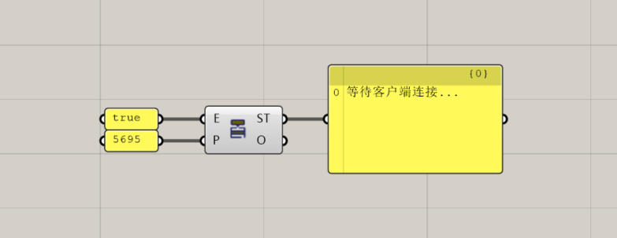

### 2 连接测试

```
> 这个项目是一个grasshopper的tcp服务项目，你可以作为客户端使用shell工具进行连接并执行相关命令。我已经创建了一个服务，端口5695，请阅读相关文件并尝试连接。
```

```python
client = GHClient(port=5695)
messages = client.connect()
client.disconnect()
return lmessages
```

- AI调用示例

```
Shell python -c " import socket import json from datetime import datetime  HOST = '127.0.0.1' PORT = 5695  t…
     成功连接到 127.0.0.1 : 5695
     发送测试数据: TestMessage
     收到 1 条响应:
       [1] Name: OK , Value: 客户端已连接
     连接已关闭
```

### 3 内置命令

首先在grasshopper中，添加一个AllComponents组件，Refresh端口为True，这会创建数据库。

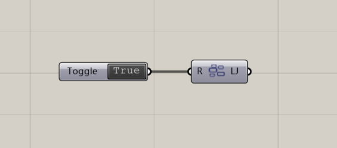

```
> 尝试使用相关工具，查询“Find similar member”组件的信息，给我介绍一下这个组件怎么使用。
```

```python
request = {
    "name": "COMPONENT",
    "info": "通过名称查找组件",
    "value": {
        "Command": "FINDCOMPONENTBYNAME",
        "Name": "Find similar member"
        }
    }
with GHClient(port=6655) as client:
    responses = client.send_command(**request)
    print(responses)
```

详细的命令列表请见 [客户端教程](CLIENT_TUTORIAL.md)。内置命令目的是提供ai工具自动获取一些信息和执行一些基本功能。

- AI调用示例

```
✦ 成功连接到5695端口并获取了"Find similar member"组件的详细信息！以下是该组件的完整介绍：
  "Find similar member" 组件详细信息
  基本信息
   - 组件名称: Find similar member
   - 昵称: FSim
   - 分类: Sets > Sets
   - 组件GUID: b4d4235f-14ff-4d4e-a29a-b358dcd2baf4
   - 描述: Find the most similar member in a set. (在一个集合中找到最相似的成员)
  函数原型
   输入参数:
   - Data: Generic Data [item]     - 要查找的目标数据项
   - Set: Generic Data [list]     - 包含多个数据项的集合
   输出参数:
   - Hit: Generic Data [item]      - 找到的最相似成员
   - Index: Integer [item]        - 该成员在集合中的索引位置
  组件功能
  这个组件的核心功能是在一个数据集合中找到与给定数据项最相似的那个成员。它通过比较算法分析数据项之间的相似性，返回
  最匹配的结果。
  使用场景
   1. 数据匹配: 在大量数据中查找最相似的项目
   2. 推荐系统: 基于用户偏好找到最相似的产品或内容
   3. 模式识别: 在数据集中找到与目标模式最接近的样本
   4. 聚类分析: 帮助确定数据点所属的类别
  示例应用
  假设你有一个包含多个几何形状的集合，想要找到与特定形状最相似的形状：
   - Data: 目标几何形状
   - Set: 几何形状集合
   - 输出: 最相似的形状及其在集合中的索引位置
   
✦ 这个组件非常适合需要相似度匹配的Grasshopper工作流，特别是在数据分析和几何处理方面。
```

## 三、rhino命令

这部分是内置的处理命令，可以执行相关rhino命令或选中相关物件。

```
> 尝试在rhino中创建一个环状体，获取其guid，并在gh中创建一个brep拾取它。
```

```python
with GHClient(port=5695) as client
    # 创建一个中心在原点，半径10，管半径2的环状体
    torus_script = "_-Torus 0,0,0 10 2"
    client.send_command("RHINO", "", {
        "Command": "RHINOSCRIPT",
        "Script": torus_script
    })
    responses2 = client.send_command("RHINO", "", {
        "Command": "GETLASTCREATEDOBJECTS"
    })
    torus_id = GHClient.extract_value(responses2, 'Object_0')['Id']
    if not torus_id:
        raise ValueError("未找到对象")
    responses = client.send_command("Design", "", {
        "Command": "AddParamWithValue",
        "ParamName": "brep",
        "X": 100,
        "Y": 100,
        "Value": torus_id
    })
```

详见[Rhino 命令](Example/CMD_RHINO/commands_RHINO.md) - Rhino 脚本命令详解。

- AI调用示例

```
已成功完成所有任务：
1. **创建环状体** - 在Rhino中创建了一个中心在(0,0,0)，半径10，管半径2的环状体
   执行脚本: _-Torus 0,0,0 10 2
2. **获取GUID** - 成功获取环状体的GUID
   GUID: 95f18744-90ac-4ba1-8d67-caf016c758df
   类型: Brep
   图层: 默认值
3. **在Grasshopper中拾取** - 成功在位置(100, 100)创建brep参数并拾取该环状体
   组件GUID: 919e146f-30ae-4aae-be34-4d72f555e7da
   实例GUID: 98de1a2c-6f06-42b6-ab03-4fa2c80230db
   组件名称: Brep
相关命令:
1. RHINOSCRIPT - 执行Rhino脚本命令
2. GETLASTCREATEDOBJECTS - 获取最后创建的对象
3. AddParamWithValue - 添加Param并设置值
```


rhino命令结合param命令，可以连续执行rhino建模到gh拾取之间的操作。

## 四、gh脚本注入

这部分功能未提供内置命令，主要是由ScriptEditor组件完成。该组件可以注入代码、设置脚本组件的输入输出端口，最后返回操作的组件的guid。这里使用GHServer的output端口获取相关命令。

在grasshopper中，添加一个GHServer组件，Enabled端口为True，Port端口为5695。添加一个ScriptEditor组件，将GHServer的output(O)输出和ScriptEditor的Code(C)输入连接。添加一个Python 3 Script组件，将Python的out输出和ScriptEditor的SC输入连接。

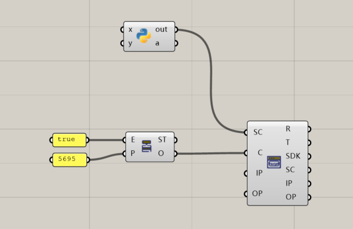

详见[scripteditor 命令](Example/SCRIPT&CMD_SCRIPT/scripteditor_test.md) - scripteditor操作命令详解。

```
> 请创建一个数学曲面。要求：使用python3，输入x和y数列，输出曲面到panel。
```

```python
from ghclient import GHClient

Script = """
# GH_COMPONENT_IO_START
# INPUT_PARAMS: [{"typeHintName": "float", "scriptParamAccess": 1, "variableName": "xs"},{"typeHintName": "float", "scriptParamAccess": 1, "variableName": "ys"}]
# OUTPUT_PARAMS: [{"typeHintName": "ghdoc Object", "variableName": "surface"}]
# GH_COMPONENT_IO_END

import rhinoscriptsyntax as rs
import math

# ======== 自定义数学函数 ========
def f(x, y):
    # 示例：正弦余弦组合曲面（可自行修改）
    return math.sin(x) * math.cos(y)

# ======== 主逻辑 ========
if xs is None or ys is None:
    surface = None
    print("输入无效：xs 或 ys 为空")
else:
    # 确保 xs 和 ys 被转换为列表（兼容 Grasshopper 数据树）
    if hasattr(xs, 'ToList'):
        xs = xs.ToList()
    if hasattr(ys, 'ToList'):
        ys = ys.ToList()
    
    # 生成点阵（按网格顺序：固定 y，遍历 x）
    points = []
    for y in ys:
        for x in xs:
            z = f(x, y)
            points.append((x, y, z))
    
    # 通过点阵创建 Nurbs 曲面
    points_2d = []
    for y in ys:
        for x in xs:
            z = f(x, y)
            points_2d.append((x, y, z))
    srf = rs.AddSrfPtGrid((len(xs), len(ys)), points_2d)
    surface = rs.coercegeometry(srf)
"""


if __name__ == '__main__':
    with GHClient(port=5695) as client:
        responses1 = client.send_command(
            "ScriptEditor",
            "测试GHPython3代码执行",
            {"OUTPUT": Script}
        )
        # 这里会返回连接的script组件guid
        script_guid = GHClient.extract_value(responses1, "OUTPUTDATA")

        client.send_command(
            name="DesignList",
            info="创建组件",
            # 命令以空格、回车隔开即可
            value='''
                ap slider 100 50 _ 0.1 num1
                ap slider 100 150 _ "0<100<100" num2
                ac series 400 50 series1
                ac series 400 150 series2
                ac panel 800 100 panel1
            '''
        )
        responses2 = client.send_command(
            name="DesignList",
            info="连接组件",
            value=f'cc num1 _ series1 step cc num1 _ series2 step cc num2 _ series1 count cc num2 _ series2 count cc series1 series {script_guid} xs cc series2 series {script_guid} ys cc {script_guid} surface panel1 _'
        )

        print(responses2)
```

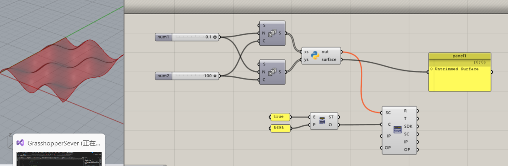

## 五、运行c#脚本

这部分功能未提供内置命令，主要是由RunScript组件或RunScript2组件完成。这里使用GHActuator的output端口获取相关命令。

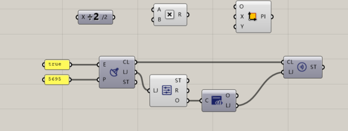

```
> 请尝试使用c#脚本获取所有组件、端口的名称。
```

```c#
from ghclient import GHClient

script1 = """
using System;
using System.Collections.Generic;
using Grasshopper;
using Grasshopper.Kernel;
using System.Text.Json;
using GrasshopperSever.Utils;

public class Script_Instance : GH_ScriptInstance
{
    private void RunScript(ref object ljson)
    {
        ljson = new Ljson("objs", "all object", JsonSerializer.SerializeToElement(GetAllGHObjects()));
    }
    
    private static Dictionary<string, string> GetAllGHObjects()
    {
        Dictionary<string, string> result = new();
        
        // 获取当前 Grasshopper 文档
        GH_Document doc = Instances.ActiveCanvas?.Document;
        if (doc == null)
            return result;  // 无活动文档

        // 遍历所有对象（包括组件和参数）
        foreach (IGH_DocumentObject obj in doc.Objects)
        {
            // 跳过隐藏或已删除的对象（根据需求决定是否包含）
            if (obj == null) continue;
            // 获取实例 GUID 和 名称
            result[obj.InstanceGuid.ToString()] = obj.Name;

            // 如果对象是组件，遍历其输入参数和输出参数
            if (obj is IGH_Component comp)
            {
                // 输入参数
                foreach (IGH_Param input in comp.Params.Input)
                {
                    result[input.InstanceGuid.ToString()] = input.Name;
                }
                // 输出参数
                foreach (IGH_Param output in comp.Params.Output)
                {
                    result[output.InstanceGuid.ToString()] = output.Name;
                }
            }
        }
        
        return result;
    }
}
"""

def get_all_components(port):
    with GHClient(port=port) as client:
        responses = client.send_command(
            "RunScript",
            "查询文档所有对象",
            {"OUTPUT": script1}
        )
        print(responses)


if __name__ == '__main__':
    get_all_components(port=5695)
```

## 六、项目文件理解

### 1、读取GH文件截图

这里使用豆包。对于识别结果，除了倒数第二个组件（用户安装插件中的螺旋线）不能识别外，其余的都识别准确。

设计图选自“逻辑大师-GH趣味案例集第六季-29-DNA螺线”。

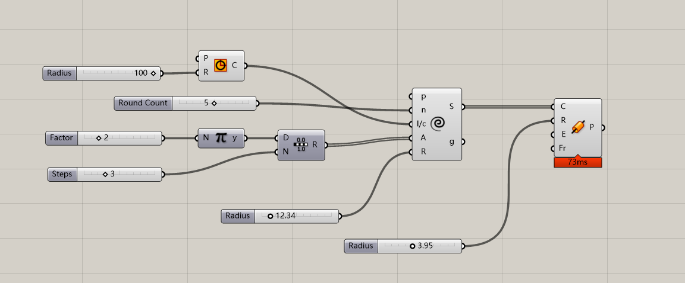

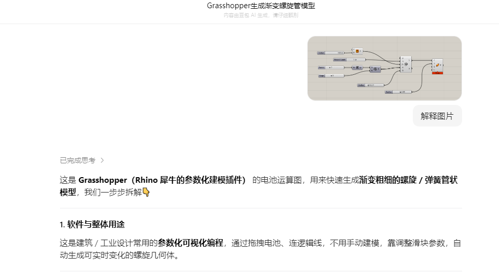

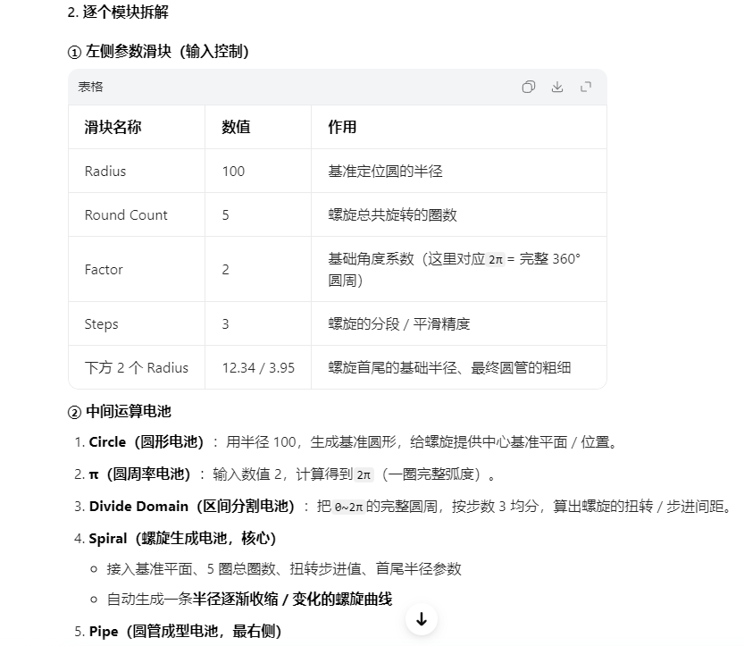

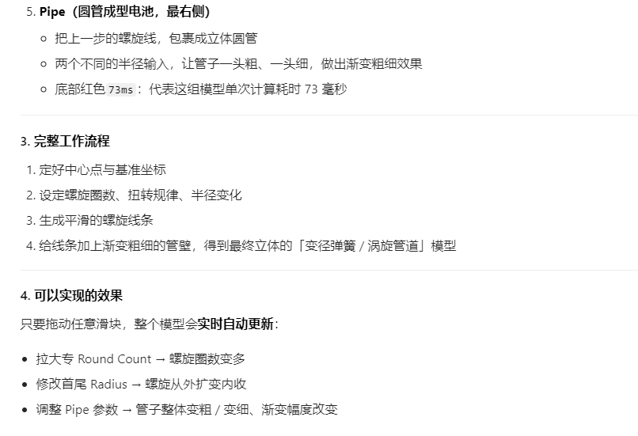

### 2、读取GH文件的组件连接关系

这部分是内置的处理命令，可以执行相关命令。

```
> 请获取当前文件的关系图，讲述主要作用。
```

```python
from ghclient import GHClient

with GHClient(port=5695) as client:
    responses1 = client.send_command(
        'DOCUMENT',
        '获取所有对象',
        {'Command': 'GETALLOBJECTS'}
    )
    print(responses)
```

```
根据提供的 Grasshopper 连接关系数据，可以清晰地看出这是一个参数化螺旋管道生成器，并带有一个外部服务器通信接口。整体设计意图是：通过调节多个滑块参数，动态生成一条三维螺旋曲线，再沿该曲线生成管道（Pipe）几何体，最后通过自定义服务器组件（GHServer）将生成结果或状态发送到外部系统（如 Web 服务、数据库或其他应用程序）。
数据流与组件角色
1. 参数输入（TopParam → 组件）
多个 Number Slider：分别控制几何的关键尺寸和细分。
Radius（圆半径）→ Circle 组件，用于定义基础圆曲线。
Factor（倍数）→ Pi 组件，用于缩放 Pi 值。
Steps（步数）→ Range 组件，控制角度序列的分辨率。
Radius（螺旋半径）→ Helix 组件。
Round Count（圈数/点数）→ Helix 组件。
Radius（管道半径）→ Pipe 组件。
Pi 组件：输出圆周率 π，乘以 Factor 后作为 Range 的 Domain（范围上限）。
Range 组件：根据 Domain [0, π×Factor] 和 Steps 生成等分数值序列，输出给 Helix 的 Angle 输入——用于控制螺旋的旋转角度步长。
2. 几何生成核心
Circle 组件：以第一个 Slider 的值为半径生成圆曲线，将其作为 Helix 的 length/curve 输入（可能用于定义螺旋的基线或长度映射）。
Helix 组件：综合以下输入，生成三维螺旋曲线：
length/curve：来自 Circle 的曲线，用于确定螺旋的路径或长度参考。
Angle：来自 Range 的角度数组，决定螺旋的旋转角度分布。
Radius：螺旋半径。
Round Count：螺旋的圈数（或总点数）。
最终输出螺旋曲线（邻接中记为 Spiral）。
Pipe 组件：接收 Helix 输出的曲线，并以最后一个 Number Slider 的值为半径，生成管道网格（Mesh）或多重曲面（Brep）。
3. 数据输出与服务器交互
GHServer 组件：看起来是一个自定义组件（并非 Grasshopper 原生），用于与外部服务通信。它接收两个输入：
Port：来自第一个 Panel 的端口号。
Enabled：来自第二个 Panel 的启用标志（布尔值或文本）。
GHServer 的行为：可能负责将生成的管道几何体（或相关数据）发送到指定的网络端口，或者监听来自外部系统的请求来触发计算。其 Status 和 OutPut 输出可能是运行状态和返回数据。
```

## 七、操作gh组件

这部分是内置的处理命令，可以添加gh组件、连接gh组件、设置param值等。

对于大量操作，推荐使用”DesignList“命令。

```
> 请你设计一个曲线干扰的方案设计。
```

下面是deepseek的方案，原理正确，但是参数取值一塌糊涂，组件顺序也比较杂乱。

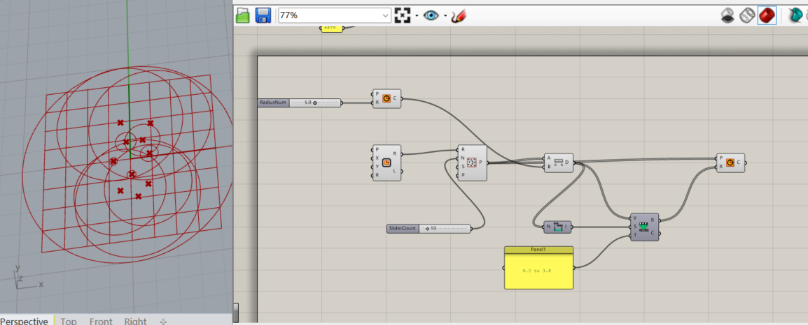

```python
from ghclient import GHClient
try:
    with GHClient(port=6879) as client:
        commands = [
            'ap slider 0 100 _ "0.0 < 5.0 < 10.0" RadiusNum',   # 创建一个滑块，无需设置path，值以范围表示
            'ac Circle 300 100 CircleCurve',                    # 创建一个圆
            'cc RadiusNum _ CircleCurve Radius',                # 连接滑块和圆，滑块本身是param，无需第二个参数
            'ac Curve@Rectangle 300 250 Rect1',                 # 创建一个矩形，矩形和矩形param冲突，这里使用 分类@名称 创建
            'ap slider 300 400 _ " 0 < 10 < 100" SliderCount',  # 创建一个滑块
            'ac "Populate 2D" 500 250 Pop2D',                   # 创建一个二维随机点
            'cc Rect1 Rectangle Pop2D Region',                  # 连接矩形和随机点
            'cc SliderCount _ Pop2D Count',                     # 连接滑块和随机点
            'ac Distance 700 250 Dist1 ',
            'cc Pop2D population Dist1 "point A" ',
            'cc CircleCurve Circle Dist1 "point B"',
            'ac Bounds 700 400 Bounds1 ',
            'cc Dist1 Distance Bounds1 Numbers ',
            'ac "Remap Numbers" 900 400 Remap1 ',
            'cc Dist1 Distance Remap1 Value ',
            'cc Bounds1 Domain Remap1 source',
            'ap Panel 700 400 _ "0.2 to 0.5" Panel1 ',
            'cc Panel1 _ Remap1 target',
            'ac Circle 1100 250 CircleGen ',
            'cc Pop2D population CircleGen Plane ',
            'cc Remap1 Mapped CircleGen Radius'
        ]
        responses = client.send_command(
            name="DesignList",
            info="曲线干扰：根据点到曲线的距离控制圆半径",
            value= " ".join(commands)
        )
        print(f"响应：{responses}")
except Exception as e:
    print(f"错误：{e}")
```

手动调整一下吧。

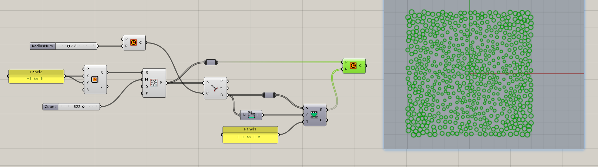

## 八、使用AI进行建筑日照分析


## 九、停车场排布

像素化算法
