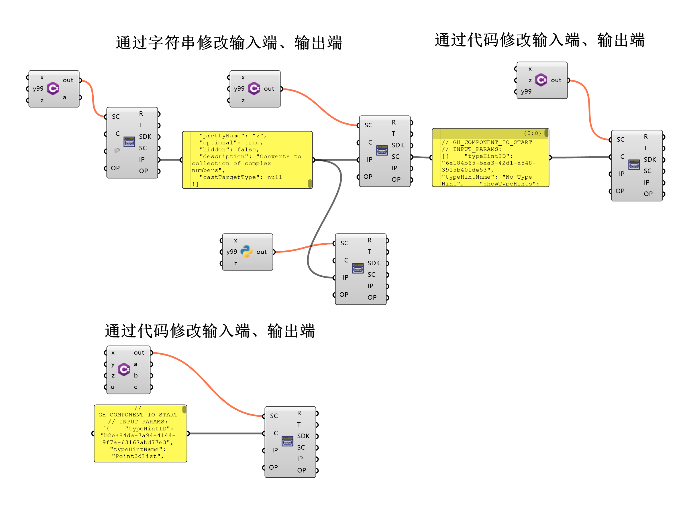

# GrasshopperSever

一个用于Rhino Grasshopper的插件，提供TCP通信、数据转换和组件信息查询功能。

中文 | [English](README_EN.md)

## 项目信息

- **版本**: 1.0
- **支持的框架**: .NET Framework 4.8, .NET 7.0, .NET 7.0-windows
- **插件GUID**: 0171a275-7e22-4b2a-9f82-b80f07a08b08

## 功能概述

GrasshopperSever插件为Grasshopper提供了以下核心功能：

1. **数据通信**: 通过TCP协议接收和发送数据
2. **数据转换**: JSON与Ljson格式互相转换
3. **组件信息查询**: 查询和搜索Grasshopper组件信息
4. **数据执行**: 执行接收到的数据命令

## 核心数据结构

### Ljson

统一的数据结构，用于表示单个数据项，包含名称、说明、时间和值。

- **Name**: 数据名称
- **Info**: 数据说明
- **Time**: 创建时间，用于标识数据版本
- **Value**: 数据值（JsonElement，可以是对象、数组或原始值）

**特性**:
- 支持JSON序列化和反序列化
- 支持深度克隆
- 实现IDisposable接口
- 支持参数的获取、搜索和设置（支持对象和数组格式）
- 提供静态方法创建常用类型的Ljson（错误、成功、组件信息等）

**LjsonHelper工具类**:
- `SerializeLjsonArray`: 序列化Ljson数组为JSON字符串
- `ParseLjsonArray`: 从JSON字符串反序列化为Ljson数组

## TCP通信命令

GrasshopperSever支持通过TCP协议发送各种命令来控制Grasshopper和Rhino。

### 命令格式

所有命令使用统一的LJSON格式：

```json
{
  "Name": "命令类型",
  "Info": "命令描述",
  "Time": "2026-03-26T10:00:00",
  "Value": {
    "Command": "具体命令名称",
    "参数名": "参数值"
  }
}
```

**Name字段（命令类型）**：
- `COMPONENT` - 组件相关命令
- `DOCUMENT` - 文档相关命令
- `RHINO` - Rhino相关命令
- `DESIGN` - 设计布局命令（组件添加、连接等）

### Component命令

#### GETALLCOMPONENTS
获取所有组件信息

#### FINDCOMPONENTBYGUID
通过GUID查找组件

#### FINDCOMPONENTBYNAME
通过名称查找组件

#### FINDCOMPONENTBYCATEGORY
通过分类查找组件

#### SEARCHCOMPONENTSBYNAME
通过名称搜索组件（模糊搜索）

### Document命令

#### SAVEDOCUMENT
保存当前文档

#### LOADDOCUMENT
加载文档

#### DATABASEPATH
获取数据库路径

### Rhino命令

#### RHINOSCRIPT
运行Rhino脚本（如：`_-Line 0,0,0 10,10,0`）

#### GETLASTCREATEDOBJECTS
获取最后创建的对象

#### SELECTOBJECTS
选择对象

#### GETANDSELECTLASTOBJECTS
获取并选择最后创建的对象（复合命令）

### Design命令

Design 命令用于控制组件的添加、移除、连接和值设置等布局相关操作。

#### ADDCOMPONENTBYGUID

通过 GUID 添加组件

**参数**：
- `ComponentGuid` - 组件 GUID
- `X` - X 坐标（数字）
- `Y` - Y 坐标（数字）

**示例**：
```json
{
  "Name": "Design",
  "Command": "AddComponentByGuid",
  "ComponentGuid": "c5b7583d-7958-49f1-ae16-6272dfb9452a",
  "X": 100,
  "Y": 100
}
```

#### ADDCOMPONENTBYNAME
通过名称添加组件

**参数**：
- `ComponentName` - 组件名称
- `X` - X 坐标（数字）
- `Y` - Y 坐标（数字）

**示例**：
```json
{
  "Name": "Design",
  "Command": "AddComponentByName",
  "ComponentName": "Addition",
  "X": 100,
  "Y": 100
}
```

#### REMOVECOMPONENT
移除组件

**参数**：
- `InstanceGuid` - 组件实例 GUID

**示例**：
```json
{
  "Name": "Design",
  "Command": "RemoveComponent",
  "InstanceGuid": "xxxx-xxxx-xxxx-xxxx"
}
```

#### SETCOMPONENTVALUE
设置组件值

**参数**：
- `InstanceGuid` - 组件实例 GUID
- `Value` - 要设置的值

**示例**：
```json
{
  "Name": "Design",
  "Command": "SetComponentValue",
  "InstanceGuid": "xxxx-xxxx-xxxx-xxxx",
  "Value": "42"
}
```

#### CONNECTCOMPONENTS
连接两个组件的参数

**参数**：
- `FromGuid` - 源组件实例 GUID
- `FromParameter` - 源组件输出参数名称
- `ToGuid` - 目标组件实例 GUID
- `ToParameter` - 目标组件输入参数名称

**示例**：
```json
{
  "Name": "Design",
  "Command": "ConnectComponents",
  "FromGuid": "instance-guid-1",
  "FromParameter": "Result",
  "ToGuid": "instance-guid-2",
  "ToParameter": "A"
}
```

#### DISCONNECTCOMPONENTS
断开两个组件参数之间的连接

**参数**：
- `FromGuid` - 源组件实例 GUID
- `FromParameter` - 源组件输出参数名称
- `ToGuid` - 目标组件实例 GUID
- `ToParameter` - 目标组件输入参数名称

**示例**：
```json
{
  "Name": "Design",
  "Command": "DisconnectComponents",
  "FromGuid": "instance-guid-1",
  "FromParameter": "Result",
  "ToGuid": "instance-guid-2",
  "ToParameter": "A"
}
```

### OUTPUT 特殊键

当 Value 字段中包含 `OUTPUT` 键时，其值会在 GHServer 的 Output 端口输出：

```json
{
  "Name": "TestMessage",
  "Info": "测试消息",
  "Value": {
    "OUTPUT": "要在输出端口显示的数据"
  }
}
```

### 数据通信特性

- **支持TCP长连接**：可连续发送多条消息
- **自动回送数据**：服务器会回送接收到的数据
- **UTF-8 BOM标记**：响应包含UTF-8 BOM，解码时需使用 `utf-8-sig`
- **完整JSON支持**：支持所有JSON数据类型和嵌套结构
- **Unicode支持**：完全支持中文和特殊字符

## 组件说明

### 数据通信组件

#### GHReceiver

根据端口创建TCP连接并接收数据，每个端口只接受一个连接。

**输入参数**:
- `Enabled` (Boolean): 是否启用服务器，默认为 false
- `Port` (Integer): 监听的端口，默认为 6879

**输出参数**:
- `Client` (TcpClientParam): Client连接对象
- `Ljson` (LjsonParam): 传入的数据
- `Status` (String): 状态

**特性**:
- 在后台线程接收数据
- 通过 `RhinoApp.InvokeOnUiThread` 通知GH电池刷新
- 只接收比上次更新的数据（基于time标签）

#### GHSender

使用TCP连接发送数据，支持批量发送。

**输入参数**:
- `Client` (TcpClientParam): Client连接对象
- `Ljson` (LjsonParam): 发送数据，按顺序发送

**输出参数**:
- `Status` (String): 发送状态

**特性**:
- 只有Ljson.time更新时才会触发发送
- 自动过滤过期数据

#### GHServer

根据端口创建TCP服务器并接收数据，接收到数据后在内部执行并作出响应。

**输入参数**:
- `Enabled` (Boolean): 是否启用服务器，默认为 false
- `Port` (Integer): 监听的端口，默认为 6879

**输出参数**:
- `Status` (String): 回复状态
- `OutPut` (Generic): 显示输出数据

### 数据转换组件

#### Json2Ljson

将JSON格式转换为Ljson。

**输入参数**:
- `String` (String): JSON格式字符串

**输出参数**:
- `Ljson` (LjsonParam): 生成的Ljson对象

#### Ljson2Json

将Ljson转换为JSON格式。

**输入参数**:
- `Ljson` (LjsonParam): 需要转换的Ljson对象

**输出参数**:
- `String` (String): JSON格式字符串

#### DataTreeLjson

将 Name, Info 和 Data Tree 构造为 Ljson。每个 branch 只能包含 1 个或 2 个元素：1 个元素转为 list，2 个元素转为 dict。

**输入参数**:
- `Name` (String): Ljson 的名称
- `Info` (String): Ljson 的说明
- `Data Tree` (Data Tree): Data Tree 数据

**输出参数**:
- `Ljson` (LjsonParam): 生成的Ljson对象

#### FindJdata

通过名称查找Jdata的值。

**输入参数**:
- `Ljson` (LjsonParam): 需要查找的Ljson对象
- `Name` (String): 需要查找的键值

**输出参数**:
- `Data` (Generic): 找到的值（基本类型或字符串）
- `DataList` (List): 找到的值列表（基本类型或字符串）

将 Name, Info 和 Data Tree 构造为 Ljson。每个 branch 只能包含 1 个或 2 个元素：1 个元素转为 list，2 个元素转为 dict。

**输入参数**:
- `Name` (String): Ljson 的名称
- `Info` (String): Ljson 的说明
- `Data Tree` (Data Tree): Data Tree 数据

**输出参数**:
- `Ljson` (LjsonParam): 生成的Ljson对象

### 信息查询组件

#### AllComponents

输出所有注册的组件信息。

**输入参数**:
- `Refresh` (Boolean): 刷新，值改变就刷新一次time

**输出参数**:
- `Ljson` (LjsonParam): 所有组件的信息

**输出结构** (Ljson.Value):
```json
{
  "categorys": "所有分类",
  "count": "组件数量",
  "components": "所有注册的组件"
}
```

#### FindComponentsByGuid

通过GUID查询组件信息。

**输入参数**:
- `Guid` (String): 组件的GUID

**输出参数**:
- `ComponentInfo` (LjsonParam): 组件信息

**输出结构** (Ljson.Value):
```json
{
  "ComponentGuid": "组件GUID",
  "ComponentName": "组件名称",
  "NickName": "组件昵称",
  "Description": "组件描述",
  "Category": "主分类",
  "SubCategory": "子分类",
  "Prototype": "函数签名"
}
```

#### FindComponentsByName

通过名称查询组件信息。

**输入参数**:
- `Name` (String): 组件名称

**输出参数**:
- `ComponentInfo` (LjsonParam): 组件信息

#### FindComponentsByCategory

通过Category查询组件信息。

**输入参数**:
- `Category` (String): 主分类名称

**输出参数**:
- `ComponentInfo` (LjsonParam): 组件信息

#### SearchComponentsByName

通过名称搜索组件，支持模糊匹配。

**输入参数**:
- `Keyword` (String): 搜索关键词

**输出参数**:
- `ComponentInfo` (LjsonParam): 组件信息列表

#### ComponentConnector

通过连接输入端，获取连接的组件的信息。

**输入参数**:
- `Input` (Generic): 连接一个组件

**输出参数**:
- `Name` (String): 组件名字
- `GUID` (String): 组件的GUID
- `InsGUID` (String): 组件对象的GUID
- `Instance` (Generic): 组件对象

#### SearchDataBase

查询数据库。

**输入参数**:
- `SQL` (String): 完整的SQL查询语句

**输出参数**:
- `Result` (String): 查询结果，以JSON格式返回

### 执行组件

#### GHActuator

对输入的数据进行执行。

**输入参数**:
- `Ljson` (LjsonParam): 需要执行的数据

**输出参数**:
- `Status` (String): 执行结果
- `Result` (LjsonParam): 处理后的Ljson结果
- `OutPut` (Generic): 显示输出数据

#### ScriptEditor

通过输入的代码修改Script组件，支持c#、python。

**输入参数**:
- `ScriptComponent` (Generic): Rhino8 Grasshopper 的脚本组件，仅支持操作一个组件
- `Code` (String): 脚本代码
- `IntputParams` (String): 输入端参数定义
- `OutputParams` (String): 输出端参数定义

**输出参数**:
- `Result` (String): 显示运行信息
- `ComponentType` (String): 显示组件信息
- `IsSDKMode` (Boolean): 代码是否是SDK模式
- `SourceCode` (String): 代码code
- `InputParams` (String): 当前输入端参数信息
- `OutputParams` (String): 当前输出端参数信息




#### RunScript

在内部运行c#脚本。本组件预留给ai直接执行脚本。

**输入参数**:
- `Code` (String): 脚本

**输出参数**:
- `Ljson` (LjsonParam): 数据输出
- `Out` (String): 调试输出

#### CommandRhino

执行rhino脚本。

**输入参数**:
- `Ljson` (LjsonParam): 要执行的Rhino命令Ljson数据，必须包含Command字段

**输出参数**:
- `Result` (LjsonParam): 执行后的Ljson结果

## 数据库功能

插件使用SQLite数据库存储数据，采用双层数据库架构：

### 数据库架构

#### 1. 主数据库（ComponentsInfo.db）
- **位置**：插件目录
- **用途**：存储全局组件信息，所有Grasshopper文档共享
- **数据表**：ALLCOMPS, MetaInfo

#### 2. 文档数据库（{_ghdata.db）
- **位置**：
  - 如果文档已保存：与gh文件同目录，命名为 `{文档名}_ghdata.db`
  - 如果文档未保存：插件目录，命名为 `TempDocument_{GUID}.db`
- **用途**：存储文档特定的数据，与文档紧密关联
- **数据表**：GHScriptModifyHistory, RhinoObjects

**优势**：
- 全局组件信息共享，提高性能
- 文档特定数据与文档绑定，便于分享和管理
- 自动清理未保存文档的临时数据

### DatabaseManager

提供以下功能：

- 管理主数据库和文档数据库
- 自动初始化数据库
- 创建和管理数据表
- 跟踪表的更新时间（主数据库）
- 提供数据库连接对象
- 执行带时间戳更新的SQL命令（主数据库）

### 主数据库表结构

#### MetaInfo表
用于跟踪主数据库中表的更新时间，包含以下字段：

| 字段名 | 数据类型 | 约束 | 说明 |
|--------|----------|------|------|
| Id | INTEGER | PRIMARY KEY AUTOINCREMENT | 主键，自增 |
| TableName | TEXT | NOT NULL UNIQUE | 表名 |
| LastUpdateTime | DATETIME | DEFAULT CURRENT_TIMESTAMP | 最后更新时间 |
| Description | TEXT | - | 表描述 |

#### ALLCOMPS表
存储所有Grasshopper组件的详细信息（全局缓存）。

| 字段名 | 数据类型 | 约束 | 说明 |
|--------|----------|------|------|
| Id | INTEGER | PRIMARY KEY AUTOINCREMENT | 主键，自增 |
| ComponentGuid | TEXT | NOT NULL UNIQUE | 组件的GUID（唯一标识） |
| ComponentName | TEXT | NOT NULL | 组件名称 |
| NickName | TEXT | - | 组件昵称 |
| Description | TEXT | - | 组件描述 |
| Category | TEXT | NOT NULL | 主分类 |
| SubCategory | TEXT | NOT NULL | 子分类 |
| Prototype | TEXT | DEFAULT '' | 包含输入输出的函数签名（JSON格式） |

### 文档数据库表结构

#### RhinoObjects表
存储Rhino中创建的对象信息（文档特定）。

| 字段名 | 数据类型 | 约束 | 说明 |
|--------|----------|------|------|
| Id | INTEGER | PRIMARY KEY AUTOINCREMENT | 主键，自增 |
| ObjectId | TEXT | NOT NULL | 对象ID（GUID字符串） |
| ObjectType | TEXT | - | 对象类型（如：Curve, Surface, Mesh等） |
| LayerName | TEXT | - | 图层名称 |
| ObjectName | TEXT | - | 对象名称 |
| CreateTime | DATETIME | DEFAULT CURRENT_TIMESTAMP | 创建时间 |
| DocumentSerialNumber | TEXT | - | 文档序列号 |
| Description | TEXT | - | 描述信息 |

#### GHScriptModifyHistory表
存储GHScript组件的修改历史记录（文档特定）。

| 字段名 | 数据类型 | 约束 | 说明 |
|--------|----------|------|------|
| Id | INTEGER | PRIMARY KEY AUTOINCREMENT | 主键，自增 |
| InstanceGuid | TEXT | NOT NULL | 组件实例GUID |
| ComponentGuid | TEXT | NOT NULL | 组件类型GUID |
| ComponentName | TEXT | - | 组件名称 |
| ModifyType | TEXT | NOT NULL | 修改类型（CODE_CHANGE或PARAM_CHANGE） |
| ModifyContent | TEXT | - | 修改内容（JSON格式） |
| Description | TEXT | - | 描述信息 |
| ModifyTime | DATETIME | DEFAULT CURRENT_TIMESTAMP | 修改时间 |

#### ComponentExchangeHistory表
存储组件交换操作的历史记录（文档特定），包括添加、删除、连接、断开等操作。

| 字段名 | 数据类型 | 约束 | 说明 |
|--------|----------|------|------|
| Id | INTEGER | PRIMARY KEY AUTOINCREMENT | 主键，自增 |
| OperationType | TEXT | NOT NULL | 操作类型（AddComponent, RemoveComponent, SetComponentValue, ConnectComponents, DisconnectComponents） |
| ComponentGuid | TEXT | - | 组件GUID |
| InstanceGuid | TEXT | - | 组件实例GUID |
| ComponentName | TEXT | - | 组件名称 |
| PositionX | REAL | - | X坐标（添加组件时） |
| PositionY | REAL | - | Y坐标（添加组件时） |
| Value | TEXT | - | 设置的值（设置组件值时） |
| FromInstanceGuid | TEXT | - | 源组件实例GUID（连接/断开操作时） |
| FromParameter | TEXT | - | 源参数名称（连接/断开操作时） |
| ToInstanceGuid | TEXT | - | 目标组件实例GUID（连接/断开操作时） |
| ToParameter | TEXT | - | 目标参数名称（连接/断开操作时） |
| OperationTime | DATETIME | DEFAULT CURRENT_TIMESTAMP | 操作时间 |
| Description | TEXT | - | 描述信息 |

**注意事项**：
- 主数据库（ComponentsInfo.db）存储全局组件信息，可随时重建
- 文档数据库与gh文件同目录，便于分享和版本控制
- 未保存文档使用临时命名，避免冲突
- 建议只读操作，不建议手动写入数据
- 可以使用SQL查询组件信息和对象信息

## 参数类型

### LjsonParam

用于在Grasshopper电池之间传递Ljson数据的参数类型。

### TcpClientParam

用于传递TCP客户端连接对象的参数类型，由GHReceiver根据端口唯一创建。

## 构建和安装

### 构建要求

- .NET Framework 4.8 或 .NET 7.0 SDK
- Grasshopper 8.29.26063.11001 或更高版本

### 构建步骤

1. 使用Visual Studio打开 `GrasshopperSever.sln`
2. 选择目标框架（net4.8, net7.0, 或 net7.0-windows）
3. 构建解决方案

### 安装

1. 将构建生成的 `.gha` 文件复制到Grasshopper组件目录
2. 重启Rhino/Grasshopper
3. 插件将自动加载

## 使用示例

### TCP通信示例

1. 创建一个 `GHReceiver` 组件，设置端口号（例如6879）
2. 将 `Enabled` 设置为 `true` 启动接收器
3. 通过TCP客户端发送JSON数据到指定端口
4. 数据将被接收并转换为Ljson格式输出

### 组件查询示例

1. 使用 `AllComponents` 获取所有组件列表
2. 使用 `FindComponentsByName` 查找特定组件
3. 使用 `SearchComponentsByName` 进行模糊搜索

### 数据转换示例

1. 创建 `Json2Ljson` 组件
2. 输入JSON字符串
3. 获取转换后的Ljson对象

## 注意事项

1. 每个端口只能创建一个TCP接收器
2. Ljson的time标签用于版本控制，只接收/发送更新的数据
3. 数据库文件位于插件目录，确保有写入权限
4. TCP通信使用UTF-8编码
5. 建议使用防火墙规则保护TCP端口

## 依赖项

- Grasshopper 8.29.26063.11001
- Microsoft.Data.Sqlite 10.0.5
- System.Data.SQLite 1.0.119
- System.Text.Json 10.0.5（仅net4.8）
- System.Resources.Extensions 10.0.5

## 许可证

请查看项目许可证文件。

## 贡献

欢迎提交问题和拉取请求。

## 联系方式

如有问题或建议，请联系插件作者。

## 相关文档

- [English Documentation](README_EN.md) - 英文版文档
- [AI客户端教程](AI_CLIENT_TUTORIAL.md) - AI客户端连接和交互指南
- [插件开发文档](design.md) - 插件开发技术文档